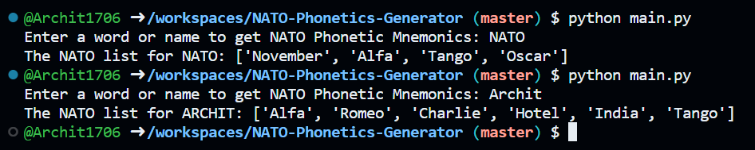

# NATO-Phonetics-Generator
- A fun CLI - NATO Phonetics Mnemonics Generator for any name input!

## What is NATO?
- The NATO phonetic alphabet is a Spelling Alphabet, a set of words used instead of letters in oral communication (i.e. over the phone or military radio). Each word ("code word") stands for its initial letter (alphabetical "symbol"). The 26 code words in the NATO phonetic alphabet are assigned to the 26 letters of the English alphabet in alphabetical order as follows:

|letter|code|
|:----:|:--:|
|A|Alfa|
|B|Bravo|
|C|Charlie|
|D|Delta|
|E|Echo|
|F|Foxtrot|
|G|Golf|
|H|Hotel|
|I|India|
|J|Juliet|
|K|Kilo|
|L|Lima|
|M|Mike|
|N|November|
|O|Oscar|
|P|Papa|
|Q|Quebec|
|R|Romeo|
|S|Sierra|
|T|Tango|
|U|Uniform|
|V|Victor|
|W|Whiskey|
|X|X-ray|
|Y|Yankee|
|Z|Zulu|

[Learn More](https://www.worldometers.info/languages/nato-phonetic-alphabet/)

### Sample

